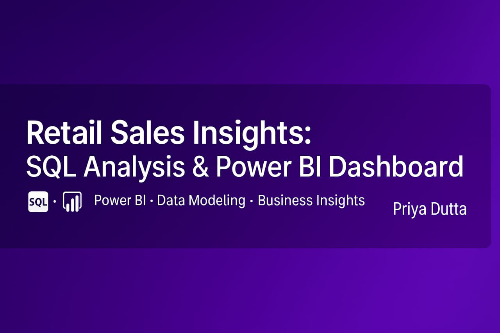

# 📊 Retail Sales Insights: SQL Analysis & Power BI Dashboard

---

## ✅ Project Overview
This project combines **SQL for data preparation and exploratory analysis** with **Power BI for interactive visualization** to uncover key sales drivers, category performance, and discount impact on profitability.  

---

## 🛠 Tools & Technologies
- **SQL** – Data cleaning, data type fixes, null checks, and EDA queries  
- **Power BI** – KPI visuals, category breakdown, regional analysis, and dynamic filters  
- **DAX** – Calculated measures for profit margins and discount impact  

---

## 📂 Dataset Information
- **customers.csv** – Customer details (region, segment, city, etc.)  
- **orders.csv** – Transaction details (sales, quantity, profit, discount)  
- **products.csv** – Product information (category, sub-category)  

---

## 🔧 Data Preparation Workflow
- Created `RetailSQLProject` database and imported 3 datasets  
- Cleaned and standardized data types (sales, discount, profit → decimals)  
- Checked for null values across all tables  
- Built SQL queries for:
  - Monthly sales trend  
  - Region-wise and segment-wise performance  
  - Profitability by category and sub-category  
  - Impact of high discounts on profit  

---

## 📈 Dashboard Preview
▶ **[Download Full Dashboard (PDF)](Retail_Sales_Insights_PowerBI_PriyaDutta.pdf)**  
*(Power BI `.pbix` file is included in the repository)*  

---

## 📌 Business Insights & Recommended Actions (Summary)
- **Home Office segment** generated highest revenue → Focus marketing on this segment  
- **Kolkata, Indore, and Mumbai** are top profit cities → Strengthen local presence  
- **Home & Electronics** categories drive profit → Expand SKUs, run promos  
- **Discounts >20% lead to losses** → Cap discounts at 15–20%  
- **Top sellers:** Product 18, 7, and 26 → Feature in campaigns  
- **East & West regions lead** in revenue → Maintain strong inventory balance  

▶ **[📄 View Full Insights & Action Plan](Retail_Sales_Combined_Insights_and_Actionables.txt)**  

---

## ▶ How to Reproduce
- Run SQL scripts: `Retail_Insights_SQL_Priya_Dutta.sql`  
- View queries in: `Retail_Insights_SQL_Queries_Readable_PriyaDutta.txt`  
- Open Power BI dashboard: `Retail_Sales_Insights_PowerBI_Priya_Dutta.pbix`  
- Full report also available as PDF in repo  

---

## 📂 Repository Structure
- **Retail_Sales_Banner/** → Project banner image  
- **customers.csv** → Customer data  
- **orders.csv** → Orders data  
- **products.csv** → Product data  
- **Retail_Insights_SQL_Priya_Dutta.sql** → Full SQL script  
- **Retail_Insights_SQL_Queries_Readable_PriyaDutta.txt** → Readable SQL queries  
- **Retail_Sales_Combined_Insights_and_Actionables.txt** → Full insights & actions  
- **Retail_Sales_Insights_PowerBI_Priya_Dutta.pbix** → Power BI file  
- **Retail_Sales_Insights PowerBI_PriyaDutta.pdf** → Dashboard PDF  
- **README.md** → Project documentation  

---

## 👩‍💻 Author
**Priya Dutta**  
🎓 Executive Certification in Data Science with AI Specialization (IIT Guwahati via AnalytixLabs)
🎓 MBA in Marketing & Finance
📍 Betul, M.P. | Open to Remote Work & Relocation
🔗 LinkedIn Profile 

---

📅 Project Timeline: June 2025

---

## 🔒 License  
This project is licensed under a **custom proprietary license**. Please refer to the [LICENSE](./LICENSE) file for detailed terms and usage restrictions.

---

